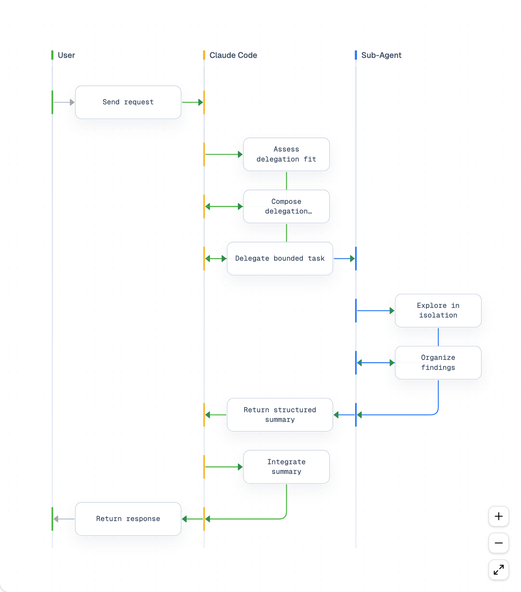
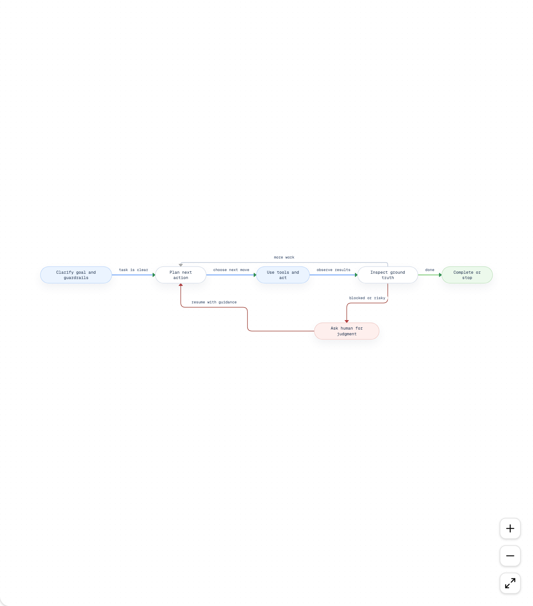

# Diagram Engine

A React + TypeScript library and web application that renders structured diagram payloads as interactive visualizations on [React Flow](https://reactflow.dev). Define your diagrams as JSON and get polished, themeable, editable diagrams instantly.

The application UI is branded as **AI Systems Designer**. The package is published as `diagram-engine`.

## What it renders

### Sequence Diagrams

Model message flows across actors with automatic lane-based layout. Actors get color-coded columns and the engine computes positions from `index`, `row`, and `from`/`to` lane relationships — no manual coordinates needed.



### State Diagrams

State machines with color-coded states, decision nodes, and labeled transitions. Supports auto-layout with crossing minimization to keep edges clean, plus manual positioning when you need fine control.



The engine also supports **overview** (architecture diagrams with icons), **entity** (data model diagrams), and **block** (flowchart) diagram types.

## Capabilities

**Diagram types** — sequence, state, overview, entity, and block diagrams, each with purpose-built node and edge renderers.

**Auto-layout** — Sequence diagrams compute lane positions automatically from actor relationships. State and block diagrams support grid-based auto-layout with crossing minimization algorithms to reduce visual clutter.

**Theme system** — Light and dark mode with CSS custom properties. Customize canvas, node, connector, and sequence actor colors at the project or per-diagram level via JSON theme tokens.

**Rich text labels** — Labels and descriptions use a Markdoc-like portable JSON format supporting paragraphs, inline code, and custom tags.

**Runtime validation** — `assertDiagramDefinition()` validates any JSON payload and throws descriptive errors for malformed input, so you catch issues before rendering.

**Interactive editing** — Drag nodes, reconnect edges, add or delete elements directly on the canvas. All changes sync back to the JSON source.

**Export** — One-click export to PNG, JPEG, or SVG from the toolbar. Programmatic export available via the Playwright-based headless script.

**Custom edge routing** — Orthogonal, dashed, and raised edge styles with automatic path computation for clean, readable connections.

**Library package** — Consume `diagram-engine` as an npm dependency. Import `buildDiagramFlow`, custom `nodeTypes`/`edgeTypes`, and the theme resolver to embed diagrams in your own React app.

## Quick start

```bash
npm install
npm run dev
```

Open the local Vite URL in your browser. Select a diagram from the sidebar to see it rendered, or edit the JSON source directly.

```bash
npm run build     # production build
npm test          # run tests
```

## Creating diagrams

Generate new diagrams from natural language using the `/create-diagram` Claude Code skill:

```
/create-diagram a three-actor checkout flow with client, server, and payment API
/create-diagram a state machine for an order lifecycle as PNG
```

Generated JSON is written to `src/data/library/` and appears in the sidebar automatically.

You can also author diagrams manually as JSON following the `DiagramDefinition` schema. Build diagrams programmatically using the exported `buildDiagramFlow()` function — see the [library API reference](src/engine/README.md) for details.

## Project structure

```
src/
  engine/          Library package — schema, layout, nodes, edges, markdoc, themes
  app/             Application UI — sidebar, toolbar, panels
  data/            Built-in fixtures and JSON library files
  data/library/    Example diagrams auto-discovered at runtime
    sequence/      5 sequence diagrams
    state/         11 state diagrams
    overview/      2 overview diagrams
    block/         2 block diagrams
scripts/           Build, release, and export scripts
assets/            README screenshots
diagram-screenshots/  Batch-generated screenshots (light + dark)
```

## Library API

For embeddable use in your own React app, install the package and see the [library consumer documentation](src/engine/README.md) for the full API reference, quick-start example, and token customization guide.
